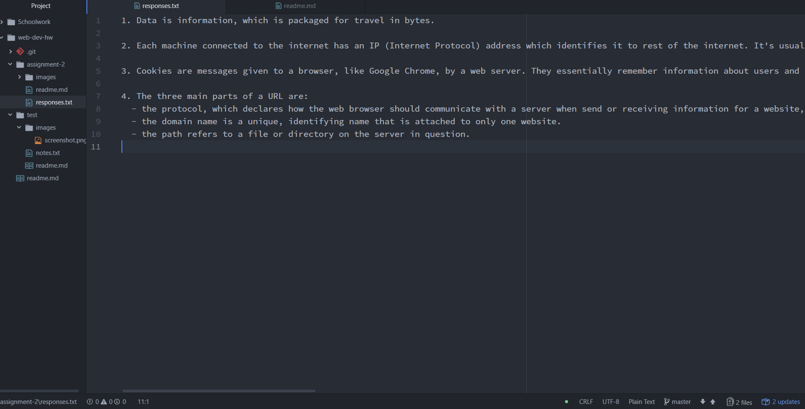

# Assignment 2
### Katy Spence

A Version Control System is a workflow tool that lets developers track changes to a file they make over time. To track these changes, the developer must commit these changes to a master often, and describing these changes helps the dev understand what they did and why at each step. This makes it easier to go back a few steps in a process to see if you changed something that ultimately ended up being something you didn't want.vCS make collaboration easier and prevent messy folder with multiple saves of variations of a project.

We're using a VCS because it helps track work history and encourages lot of experimentation. We're using Git because it's free and widely popular in the dev space.

[Here is a link to my responses.](./responses.txt)

#### Work Summary
This cycle of work was pretty straightforward for me. I have a lot of knowledge and setup from Creative Coding last semester, so it was nice to have a lot of the prep work done and my preferences already set.

This will be an interesting class because I can already tell the workflow will be a little different from CC. I like learning new ways to do things, and it will make me more flexible in my learning.

I like that we've done some more background research on how the internet works. I still find it pretty confusing, but I think I'm starting to get more of a handle on it. Looking forward to the rest of the semester.

